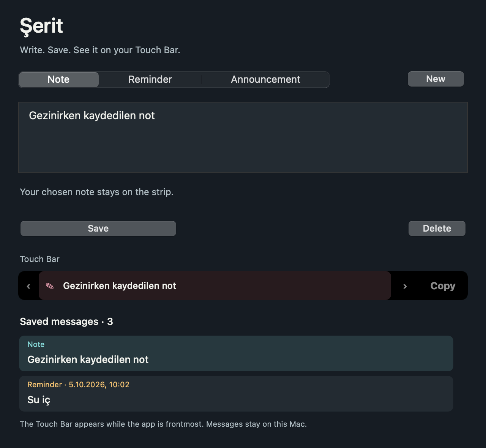

# Şerit · Touch Bar Post

A little announcement board, note corner and reminder desk for your MacBook Touch Bar. Native Swift/AppKit, no third-party packages, macOS 11+, Universal Intel and Apple Silicon.

[Download the app](https://github.com/metealpkarvan/touch-bar-post/releases/latest) · [Türkçe kullanım kılavuzu](README.tr.md)



## A strip of your own

- **Announcements:** Post a short message in one of four inks. Long text scrolls across the strip.
- **Notes:** Keep a title and a little context. Tap the centre to edit; explicitly copy to your clipboard.
- **Reminders:** Choose a date/time. Due reminders rise to the front across all scenes; complete with ✓ or postpone five minutes in the editor.
- **Scenes:** Desk, Break and Home keep separate active collections. Pinned scene cards precede ordinary notes.
- **Curtain:** Conceal strip and menu text, clear this app’s delivered notifications and reschedule pending reminders with generic content. The editor remains visible.
- **Hold:** Stop card rotation and scrolling. Motion can also be disabled; macOS Reduce Motion is respected.
- **No Touch Bar:** Use the identical on-screen controls or an optional small floating Desk Strip panel.


## Install

Download `TouchBarPost-v1.0.0-universal.zip`, unzip and move **Şerit.app** to Applications. Open it, choose **Data / quick start → Add sample cards**, or create your own note. Change the language using the top-right button. Choose a kind, title, context and, for reminders, a date/time. Press **Post to strip**.

The release is ad-hoc signed for integrity; it is not Developer ID signed or Apple notarized. If Gatekeeper blocks first launch, attempt to open the app, then use **System Settings → Privacy & Security → Open Anyway**. Wording varies by macOS. No system-wide security changes are needed. Source and SHA256 checksums are available.

## Touch Bar and notification boundaries

Apple’s public AppKit Touch Bar displays the **frontmost app’s** controls. This app does not replace other apps’ Touch Bars. Closing the window keeps Şerit running in the menu bar; **⌘Q / Quit** ends it. A real Touch Bar requires a supported MacBook Pro; the desktop strip works on either Mac CPU family.

Notification permission is requested only when you click **Allow notifications**. With permission, the earliest **60 future active reminders** are scheduled as one-shot local notifications, managed by macOS even when the app quits. Other reminders join the plan when the app runs again. Delivery depends on system permission, Focus, sleep and OS policy. Past deadlines stay ready in the app without replaying an old OS alert. Reminders do not repeat automatically. Local date/time input is saved as an instant.

Curtain affects the strips, menu entries and notifications; it does not conceal the editor or previously copied clipboard text. Selecting a card holds the strip. Click **Resume strip** to continue. Automatic rotation stops while a reminder is due or the app is inactive. There is no login item installed automatically.

## Local data

Data lives at `~/Library/Application Support/TouchBarPost/archive.json`, unencrypted. No account, cloud, analytics, AI API or background network calls. Limit: 200 cards, 80 title characters, 400 context characters, 1 MB JSON import. The source link opens your browser only when you choose it.

Use **Data** for JSON backup/import, Markdown export and the archive folder. Validated writes retain the previous archive. Import/reset creates a separate recovery copy of the original before replacement. Corrupt archives block writes instead of being silently discarded and can be exported byte-for-byte. Import disables notifications until you choose to enable them again. Recovery copies are retained until you remove them.

## Build and verify

```bash
swift run -j 2 PostRulesTests
swift build -j 2 --product TouchBarPost
.build/debug/TouchBarPost --smoke-test --screenshots output/verification
bash scripts/package.sh 1.0.0
```

Requires Xcode Command Line Tools and Swift 5.7+; packaging also uses Python 3's standard ZIP library to preserve UTF-8 names and executable permissions. End users need neither toolchain nor Python. Notifications need the packaged `.app`. No external packages. CI runs core and actual AppKit item/action checks on native Intel/arm64 hosts before checking Universal packaging. Integration checks use fictional records, temporary files, no clipboard writes and no notification permission request. [Verification](docs/VERIFICATION.md) separates those checks from physical-device and notification-delivery tests.

[Design](docs/DESIGN.md) · [Architecture](docs/ARCHITECTURE.md) · [Hardware checklist](docs/HARDWARE-CHECKLIST.md) · [Roadmap](docs/ROADMAP.md)

MIT © 2026 Mete Alp Karvan
