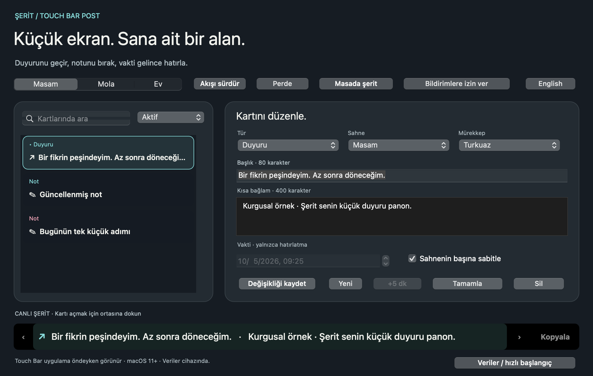

# Şerit · Touch Bar Post

**Touch Bar’ına bir duyuru panosu, bir not köşesi ve küçük bir hatırlatma masası.** Swift ve AppKit ile geliştirilmiş, macOS 11+ için Intel/Apple Silicon Universal uygulama.

[Uygulamayı indir](https://github.com/metealpkarvan/touch-bar-post/releases/latest) · [English](README.md)



## Neler yapabilirsin?

- **Duyuru geçir:** “Bir fikrin peşindeyim, az sonra döneceğim” gibi bir mesajı renkli, kayan şeride bırak.
- **Not bırak:** Kısa bir başlık ve bağlam yaz. Kartın ortasına dokunarak düzenle; **Kopyala** ile metni panoya al.
- **Vakti gelince hatırla:** Tarih/saat seç. Hatırlatmanın vakti gelince bütün sahnelerde öne çıkar; **✓** ile tamamla, editörde **+5 dk** ile ertele.
- **Sahneni değiştir:** Masam, Mola ve Ev kartlarını ayrı tut. Sahne başına sabitlenen kartlar diğer notlardan önce gelir.
- **Perdeyi kapat:** Touch Bar, ekran şeridi ve menü çubuğundaki özel metinler gizlenir; yeni sistem bildirimlerinin içeriği genel bir hatırlatmaya dönüşür. Editör açık kalır.
- **Akışı tut:** Kart dolaşımı ve kayan metin durur. Hareketi tümüyle kapatabilir; macOS’un Hareketi Azalt tercihi de dikkate alınır.
- **Touch Bar’ın yoksa:** Aynı işlevleri ana penceredeki şeritte ve isteğe bağlı küçük “Masada şerit” penceresinde kullan.


## Kur ve dene

1. Releases’ten `TouchBarPost-v1.0.0-universal.zip` dosyasını indir, aç ve **Şerit.app** uygulamasını Applications klasörüne taşı.
2. Uygulamayı aç. **Veriler / hızlı başlangıç → Örnek kartlar ekle** ile kurgusal örnekleri dene veya kendi notunu yaz.
3. **Tür** seç, başlık ve kısa bağlam gir. Hatırlatma seçtiysen tarih/saat belirt, **Şeride bırak** düğmesine bas.
4. Touch Bar’da sahne düğmesini, önceki/sonraki oklarını, ortadaki kartı, eylem düğmesini ve **+** hızlı not düğmesini kullan.
5. Başka uygulamalardayken de sistem uyarısı istiyorsan **Bildirimlere izin ver** düğmesine bas. İzin ilk açılışta kendiliğinden istenmez.

Paket bütünlüğü için ad-hoc imzalıdır; Apple Developer ID imzası ve noter onayı yoktur. Gatekeeper ilk açılışı engellerse uygulamayı açmayı denedikten sonra **Sistem Ayarları → Gizlilik ve Güvenlik → Yine de Aç** yolunu kullan. macOS sürümüne göre adlar değişebilir. Güvenlik ayarlarını tüm sistem için kapatman gerekmez. Kaynak kodu ve SHA256 checksum’u inceleyebilirsin.

## Touch Bar ve hatırlatma davranışı

Resmi AppKit Touch Bar’ı, uygulama **öndeyken** gösterir. Şerit başka uygulamaların Touch Bar’ını ele geçirmez. Pencereyi kapatmak uygulamayı kapatmaz: menü çubuğundaki **✎** simgesi üzerinden notlara ve hatırlatmalara dönersin. **⌘Q / Çık** uygulamayı kapatır.

Sistem bildirimleri izin verilmişse gelecekteki en yakın **60 aktif hatırlatma** için planlanır ve uygulama kapalıyken de macOS tarafından yönetilir. Sonraki kayıtlar uygulama tekrar çalışırken planlamaya alınır. Bildirimlerin gösterimi macOS izinleri, odak modu, uyku ve sistem davranışına bağlıdır. Geçmiş tarihli kayıtlar yeniden sistem bildirimi üretmez; uygulamada “Vakti geldi” olarak kalır. Hatırlatmalar **tek seferliktir**; takvim tekrarları yoktur. Tarih/saat yerel saat diliminde girilir, kaydedilen tarih bir zaman anıdır.

Perde mevcut Şerit bildirimlerini Bildirim Merkezi’nden kaldırır ve gelecektekileri genel içerikle yeniden planlar. Başlık/bağlam alanlarını veya panoya daha önce kopyaladığın metni gizlemez. Kartı elle seçmek akışı tutar; devam etmek için **Akışı sürdür** düğmesini kullan. Otomatik dolaşım, vakti gelen bir hatırlatma varken ve uygulama arka plandayken durur.

## Kayıtların ve yedeklerin

Kayıtlar `~/Library/Application Support/TouchBarPost/archive.json` içinde tutulur. Hesap, sunucu, analiz, AI API’si veya ağ üzerinden eşitleme yoktur. Metinler şifreli değildir. En fazla 200 kart; başlık 80, bağlam 400 karakter; JSON yedek 1 MB.

**Veriler** menüsünden JSON yedeği, Markdown çıktısı ve kayıt klasörüne ulaşabilirsin. Yedek yüklemeden ve sıfırlamadan önce orijinalin ayrı bir kurtarma kopyası saklanır. Normal kayıtta bir önceki geçerli sürüm `archive.previous.json` olur. Bozuk bir arşiv otomatik olarak boş veriyle değiştirilmez: yazma engellenir, orijinali dışa aktarabilir veya geçerli bir yedek yükleyebilirsin. İçe aktarım sonrası bildirimleri yeniden açman gerekir. Kurtarma kopyaları otomatik silinmez.

## Geliştirme

```bash
swift run -j 2 PostRulesTests
swift build -j 2 --product TouchBarPost
.build/debug/TouchBarPost --smoke-test --screenshots output/verification
bash scripts/package.sh 1.0.0
```

Xcode Command Line Tools ve Swift 5.7+ gerekir; paketleme UTF-8 dosya adlarını ve çalıştırma izinlerini korumak için Python 3'ün standart ZIP kütüphanesini de kullanır. Uygulamayı kullananların Swift veya Python kurması gerekmez. Sistem bildirimleri için paketlenmiş `.app` çalıştır. Harici paket bağımlılığı yoktur. CI native Intel/arm64 kural ve AppKit kontrollerini, ardından Universal paketi doğrular. Fiziksel Touch Bar parmak davranışı ve gerçek bildirim teslimi için [cihaz kontrol listesi](docs/HARDWARE-CHECKLIST.md) bulunur; bunlar otomatik testle yapılmış gibi sunulmaz.

[Tasarım](docs/DESIGN.md) · [Mimari](docs/ARCHITECTURE.md) · [Doğrulama](docs/VERIFICATION.md) · [Yol haritası](docs/ROADMAP.md)

MIT © 2026 Mete Alp Karvan
